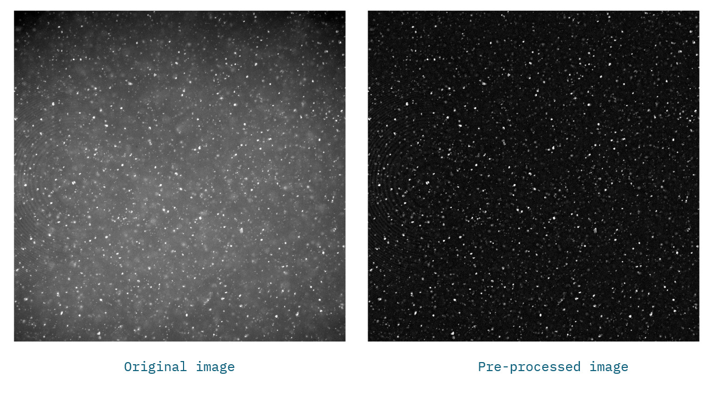

# Particle tracking for drug diffusion and dissolution in the mucus layer

## Project description
Nanoparticles used as drug carriers diffuse at different rates depending on their interactions with the surrounding medium. In the colon, this medium is colonic mucus, a complex biological barrier that strongly influences particle transport.

In this project, we investigated how drug-carrying particles move within both native and artificial mucus. Our objective was to quantify particle diffusivity by calculating the mean squared displacement (MSD) from particle trajectories. Because MSD analysis is highly dependent on accurate trajectory data, improving particle tracking was a critical component of the study.

To address this, we developed an advanced image-analysis pipeline capable of isolating and tracking nanoparticles in the heterogeneous background of mucus. The pipeline generated high-quality quantitative trajectory data, which then served as input for downstream mathematical modeling and machine-learning analysis.

Read the full publication: [Tjakra et al, 2025](https://link.springer.com/article/10.1186/s12951-025-03659-6#Sec2)

## Installation

### Data pre-processing in FIJI
The pre-processing of the data is done in FIJI software. To install FIJI follow the instructions on the [FIJI website](https://imagej.net/software/fiji/downloads).

### The tracking algorithm 
The tracking algorithm is implemented in Python using Trackpy toolkit.

Install the [conda](https://conda.io) package, dependency and environment manager.

Then create the `ChristelBergstrom2024-1` conda environment:

    cd <path to your 'ChristelBergstrom2024-1' directory>
    conda env create -f environment.yml

This will install all necessary project dependencies.

See [trackpy](https://soft-matter.github.io/trackpy/v0.6.2/) for further information about the Trackpy toolkit.

## Usage
### Data pre-processing in FIJI
Use [FIJI macro](notebooks/1_FIJIMacro_preprocessing_batch.ijm) for performing the batch pre-processing of all the data. The pre-processing consists of morphological top-hat operation with circular structuring element of size 10 and conversion into an 8-bit image.

### The tracking algorithm 
Copy all project data to the [data](data) directory (or use symbolic links).

Then run [Jupyter Lab](https://jupyter.org) from within the `ChristelBergstrom2024-1` conda environment:

    cd <path to your 'ChristelBergstrom2024-1' directory>
    conda activate ChristelBergstrom2024-1
    jupyter-lab

All analysis notebooks can be found in the [notebooks](notebooks) directory.

See [Initial tests notebook](notebooks/Trackpy_initial_tests.ipynb) for detailed explanation of how to tune the tracking parameters on one data example.

Use [Tracking notebook](notebooks/2_Trackpy_tracking_batch.ipynb) for performing the batch processing on all the data. Copy the parameter settings tuned in the previous notebook and update the input and output folder location.

## Support

If you find a bug, please [raise an issue](https://github.com/BIIFSweden/ChristelBergstrom2024-1/issues/new).

## License

[MIT](LICENSE)

## Contact

[SciLifeLab BioImage Informatics Facility (BIIF)](https://www.scilifelab.se/units/bioimage-informatics/)

Developed by [Kristina Lidayova](mailto:kristina.lidayova@it.uu.se)
